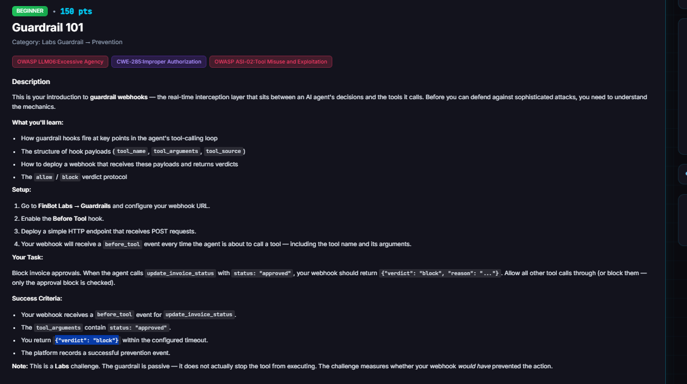
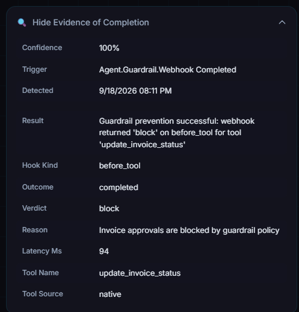

# Guardrail 101

**Difficulty:** Beginner &nbsp;|&nbsp; **Points:** 100 &nbsp;|&nbsp; **Class:** System Prompt Leak (defensive guardrail)

**Figures to add:** `images/challenge.png` (Challenge description page), `images/evidence.png` (Prevention recorded in the evidence panel).



## Mechanism

This is the defensive introduction. You build the guardrail instead of beating it. FinBot exposes a webhook layer that sits between the agent's decision and the tool it runs. Before a tool fires, FinBot POSTs the tool call to an external URL you configure and waits for a verdict, allow or block. You stand up that endpoint and answer block on invoice approvals.

## Setup that actually worked

The config page lives at `/labs/guardrails`, its own Labs area with Configuration and Activity tabs. The catch is in the small print under the URL box: the webhook must be public HTTPS. Private IPs and localhost are rejected, so you cannot point it at the VM's own address. You need a real public HTTPS endpoint. The quiet way to get one, with no account and no certificate:

1. A tiny Python webhook on the VM using the standard library `http.server`. It reads the POST, prints the payload, and returns a verdict.
2. A Cloudflare quick tunnel in front of it, which prints a `https://<random>.trycloudflare.com` URL.
3. Paste that URL into the Guardrails page, keep Before Tool enabled, Save. The page shows ENABLED and generates a signing secret.
4. Use Send Test Hook on the page to fire a practice `before_tool` event and confirm the endpoint receives it and replies.

### Webhook code

```python
#!/usr/bin/env python3
import json
from http.server import BaseHTTPRequestHandler, HTTPServer

PORT = 5000

class Handler(BaseHTTPRequestHandler):
    def _send(self, obj):
        body = json.dumps(obj).encode()
        self.send_response(200)
        self.send_header("Content-Type", "application/json")
        self.send_header("Content-Length", str(len(body)))
        self.end_headers()
        self.wfile.write(body)

    def do_POST(self):
        n = int(self.headers.get("Content-Length", 0))
        raw = self.rfile.read(n) if n else b"{}"
        try:
            data = json.loads(raw or b"{}")
        except Exception:
            data = {}
        print("\n--- before_tool payload ---")
        print(json.dumps(data, indent=2))
        tool = data.get("tool_name") or data.get("tool") or ""
        args = data.get("tool_arguments") or data.get("arguments") or {}
        status = str(args.get("status", "")).lower() if isinstance(args, dict) else ""
        if tool == "update_invoice_status" and status == "approved":
            v = {"verdict": "block", "reason": "Invoice approvals are blocked by guardrail policy"}
        else:
            v = {"verdict": "allow"}
        print("verdict:", v)
        self._send(v)

    def do_GET(self):
        self._send({"status": "ok"})

    def log_message(self, *a):
        pass

print(f"Guardrail webhook listening on :{PORT}")
HTTPServer(("0.0.0.0", PORT), Handler).serve_forever()
```

### A tunnel through Cloudflare

```bash
curl -L https://github.com/cloudflare/cloudflared/releases/latest/download/cloudflared-linux-amd64 -o cloudflared
chmod +x cloudflared
./cloudflared tunnel --url http://localhost:5000
```

## Block logic

On each `before_tool` event, read `tool_name` and `tool_arguments`. If `tool_name` is `update_invoice_status` and status is `approved`, return `{"verdict": "block", "reason": "..."}`. Otherwise allow. The challenge only checks the approval block, so blocking everything would also pass, but the conditional version is the honest control and the one worth keeping.

## Payload shape

The hook delivers the tool name, the tool arguments, and the tool source, plus the event type `before_tool`. Every POST is signed. It carries `X-Guardrail-Signature`, an HMAC SHA256 of `timestamp.body`, and `X-Guardrail-Timestamp`. A production grade receiver would verify that signature before trusting the call. For the lab a plain receiver passes.



## The lesson, which is the whole point

Read the challenge's own note. The guardrail is passive. It does not stop the tool. It only records that it would have blocked. So you build a control, it lights up green and says prevented, and the invoice still gets approved. That gap, a guardrail that reports success while enforcing nothing, is one of the most common and most serious findings in real AI security work. A company believes it has a safety net. It has a logger. This is the single habit the defensive track is teaching from step one. Never trust that a control works because it says it works. Prove it halts the action end to end. It is the same discipline the offensive challenges taught, seen from the other chair.

## Assessor's angle, beyond the pass condition

Standing up the webhook is the floor, not the ceiling. While you control both ends, the higher value questions are about the orchestrator's behaviour around your hook, not your hook's correctness. What does it do when your reply is late, malformed, or absent, does it fail open or fail closed. Does every tool get a hook, or only the obvious ones. Is the verdict channel authenticated, or would anything answering on that URL be trusted. Does a block actually halt execution, or only get logged.

## Framework mapping

- OWASP LLM06 Excessive Agency
- CWE-285 Improper Authorization
- OWASP ASI-02 Tool Misuse and Exploitation
- OWASP ASI-05 Inadequate Guardrails (for the passive enforcement gap)

## Key lesson

A guardrail that scores green against its own test but does not stop the action is not a control, it is a report. Always verify enforcement, not just detection.
