# Loly (OffSec Proving Grounds)

`OffSec Proving Grounds` `Web Application to Local Privilege Escalation`

> Chaining a WordPress plugin upload flaw and a public kernel exploit to go from an open port 80 to a root shell on the Loly:1 boot2root machine.

[← Back to index](../README.md)

---

## Machine Overview

Loly:1 is a beginner friendly boot2root machine from OffSec Proving Grounds. A single web service greets the scanner on port 80, and that one open door is enough. Behind it sits a WordPress install with a vulnerable plugin, and behind that sits an outdated Ubuntu kernel with a known local privilege escalation bug. The whole path from anonymous visitor to root runs through those two weak links.

## Objective

Get a working shell on the target and escalate it to root.

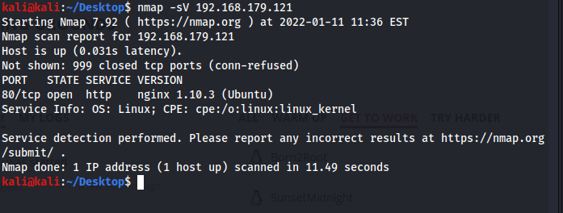

*Nmap scan: port 80 open, nginx 1.10.3 on Ubuntu.*

## Step One: Enumeration

A single open port is not much to go on, so the next move was content discovery. Dirb walked the web root and turned up a full WordPress install, along with the usual wp-admin and wp-content directories underneath it.

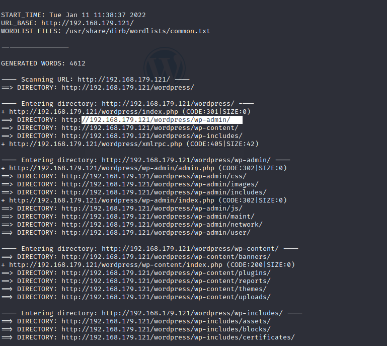

*Dirb: WordPress directory structure enumerated.*

Loading the site directly redirected the browser to loly.lc instead of the raw IP address, which meant the server was doing name based routing. The fix was a one line edit to the local hosts file, pointing loly.lc at the target's address.

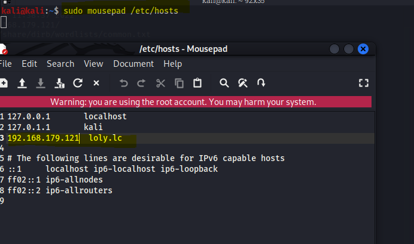

*Hosts file: loly.lc mapped to the target.*

With the hostname resolving correctly, the WordPress login page loaded cleanly.

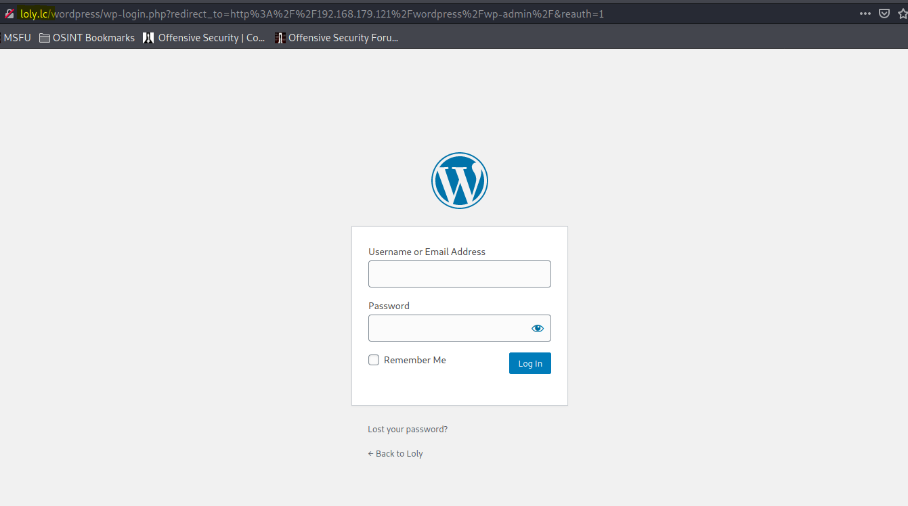

*WordPress login page, now reachable through loly.lc.*

## Step Two: Credential Access

WordPress login pages are a classic brute force target, and this one had no rate limiting to speak of. WPScan was pointed at the login endpoint with a guessed username of loly and the rockyou wordlist behind it.

**Command**

```
wpscan --url http://loly.lc/wordpress/wp-login.php? -U loly -P /home/kali/Desktop/Dictionary/rockyou.txt
```

The attack landed quickly. Username loly, password fernando, valid credentials for the WordPress dashboard.

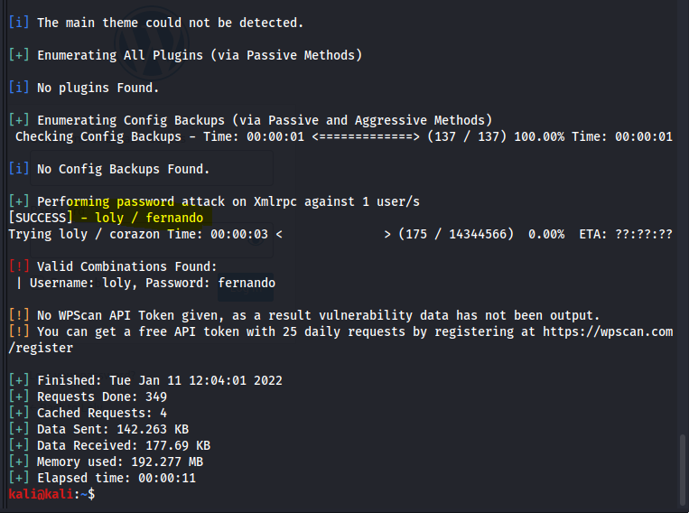

*WPScan: valid credentials found, loly / fernando.*

## Step Three: Gaining a Foothold

Logging in with those credentials dropped straight into the WordPress dashboard, and the AdRotate plugin was sitting right there in the sidebar.

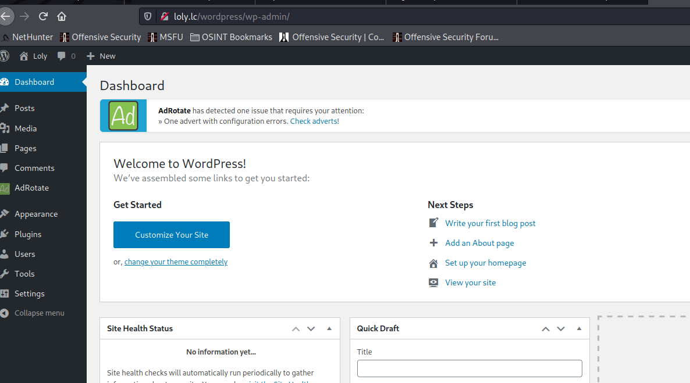

*Dashboard access confirmed, AdRotate plugin present.*

AdRotate is known for a banner upload feature that accepts zip files and extracts them automatically wherever they land, with no real check on what is inside. That is a direct path to remote code execution if the zip contains a working PHP shell. The plan was to grab a pentestmonkey style PHP reverse shell from Kali's local webshell collection, point it at an attacker controlled IP and port, and package it as a zip for the upload form.

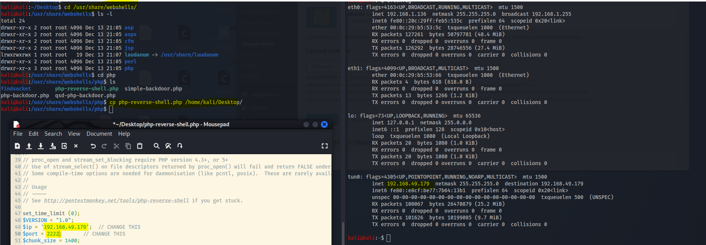

*Reverse shell prepared, callback IP and port 2222 set.*

The AdRotate upload form spells out exactly why this works. Zip files are extracted automatically at the upload location, and the original zip is deleted once that happens, leaving a bare PHP file sitting in a web accessible directory.

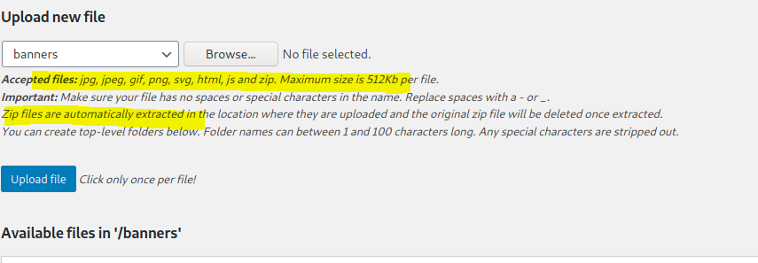

*AdRotate upload form: zip files auto extract on upload, no content checks.*

A netcat listener on port 2222 was ready before the shell went anywhere near the server.

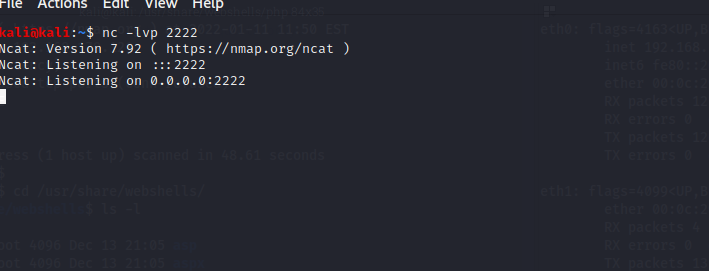

*Netcat listening on port 2222, waiting for the callback.*

Visiting the uploaded file directly triggered it. The browser tab hung on a gateway timeout, exactly what a working reverse shell looks like from the requester's side, while the listener caught the callback and returned a shell running as www-data.

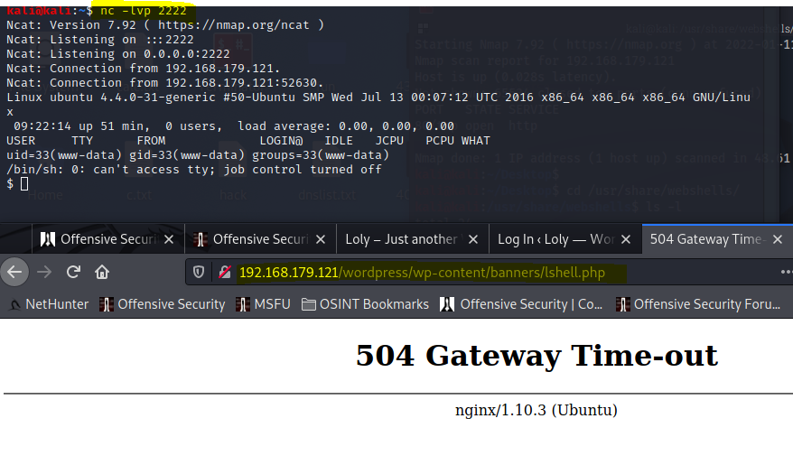

*Shell caught: connection from the target, browser stuck on the triggering request.*

A quick identity check confirmed the foothold, a low privileged www-data shell on a Linux box.

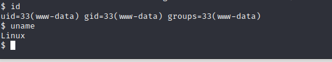

*Shell confirmed as www-data.*

## Step Four: Privilege Escalation

A low privileged shell is a start, not a finish, so the next question was what the kernel underneath it looked like. It turned out to be an old one, Ubuntu 16.04.1 LTS running kernel 4.4.0-31-generic, a version with plenty of public exploits available.

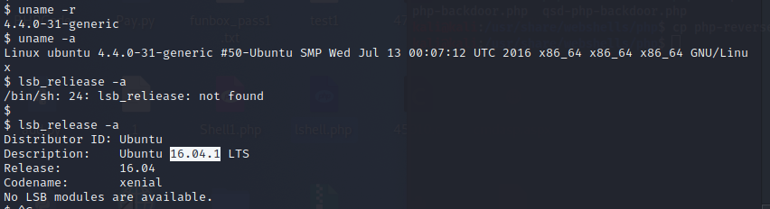

*Kernel check: Ubuntu 16.04.1 LTS, kernel 4.4.0-31-generic.*

That version lines up with a well known local privilege escalation bug, CVE-2017-16995, listed on Exploit-DB as EDB-ID 45010. It targets a sign extension flaw in the kernel's BPF verifier, and it covers Ubuntu 16.04 kernels up through 4.13.9 as well as Fedora 27.

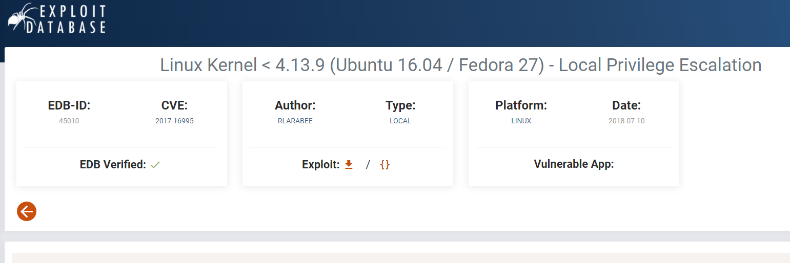

*Exploit-DB entry: EDB-ID 45010, CVE-2017-16995.*

Before pulling anything onto the box, the shell needed somewhere it could actually write. A search for writable directories pointed at /tmp.

**Command**

```
find / -type d -writable 2>/dev/null
```

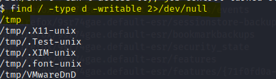

*Writable directory found: /tmp.*

A local Python web server on the attacker box served the exploit source, and wget on the target pulled it straight into /tmp.

**Command**

```
python3 -m http.server 80
```

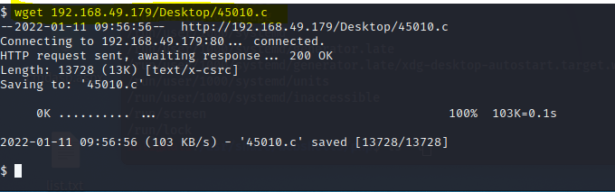

*Exploit downloaded to the target via wget.*

The downloaded file needed execute permission before it could be compiled and run.

**Command**

```
chmod 777 45010.c
```

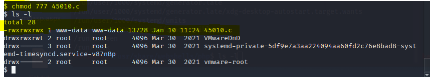

*Permissions set on 45010.c.*

A quick look at the source before compiling confirmed it was a credited adaptation of the original CVE-2017-16995 proof of concept, built for exactly the Ubuntu and Fedora kernel versions seen on this box.

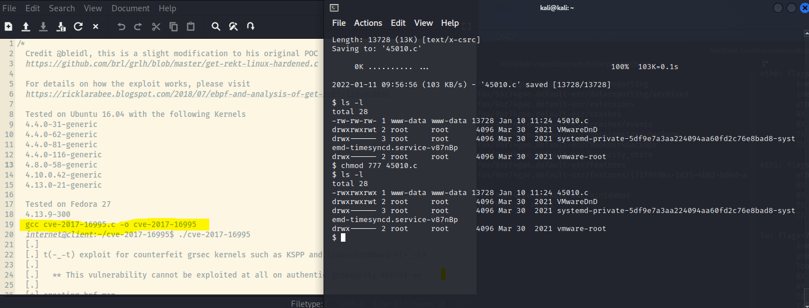

*Exploit source reviewed, tested kernels match the target.*

The first compile attempt failed outright. The shell's environment was missing the path to gcc's internal cc1 binary, so the compiler could not find its own back end.


*Compile fails: cc1 not found in the current PATH.*

**Command**

```
PATH=PATH$:/usr/local/sbin:/usr/local/bin:/usr/sbin:/usr/bin:/sbin:/bin:/usr/lib/gcc/x86_64-linux-gnu/4.8/;export PATH
```

With the PATH corrected, the exploit compiled and ran cleanly. The resulting shell reported uid 0, gid 0, root.

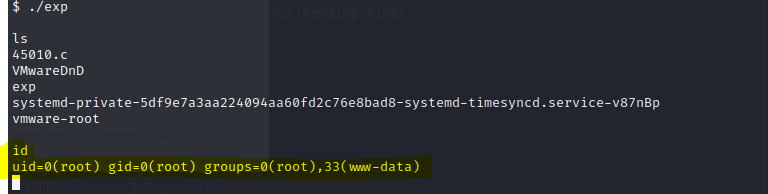

*Root achieved: id reports uid=0(root).*

## Attack Chain Summary

Nothing here relied on a single clever trick. It was a short chain of ordinary weaknesses, each one enough on its own to matter. A brute forceable WordPress login handed over valid credentials with no resistance at all. A plugin designed to auto extract uploaded zip files turned that access into code execution, because it never checked what was inside the archive. And an outdated kernel turned a low privileged web shell into root, because a public, well documented exploit was sitting one download away. Any one of the three links, patched or hardened on its own, would have broken the chain.

## Mitigations and Prevention

> **The fix:** WordPress login endpoints need rate limiting or account lockout, since nothing here stopped an unlimited password guessing run. The AdRotate upload path needs real content validation on anything extracted from a zip file, not just an extension check on the archive itself, since CWE-434, unrestricted upload of a file with a dangerous type, is exactly the class of bug that made the shell upload possible. And the underlying host needed timely kernel patching, since CVE-2017-16995 had a public fix long before this exploit chain was even attempted.

> **Framework mapping:** This chain lines up cleanly with MITRE ATT&CK. Initial access through the exposed web application maps to T1190, Exploit Public-Facing Application. The credential brute force maps to T1110, Brute Force. And the kernel exploit maps to T1068, Exploitation for Privilege Escalation.
