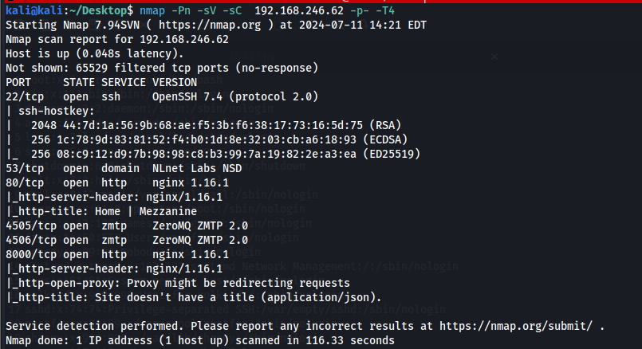
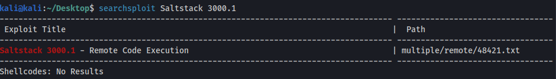
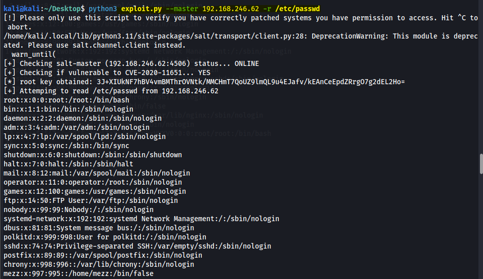
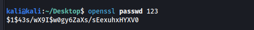
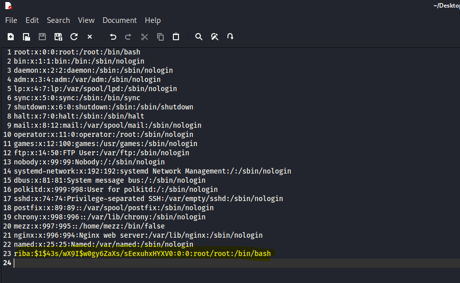
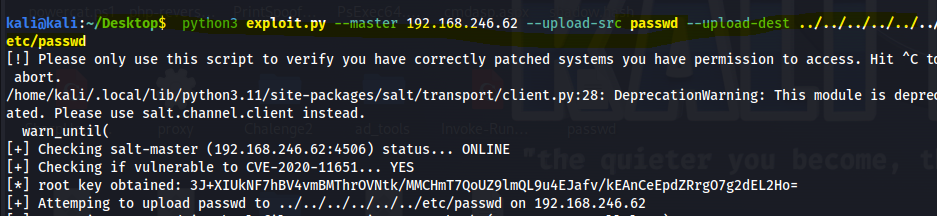
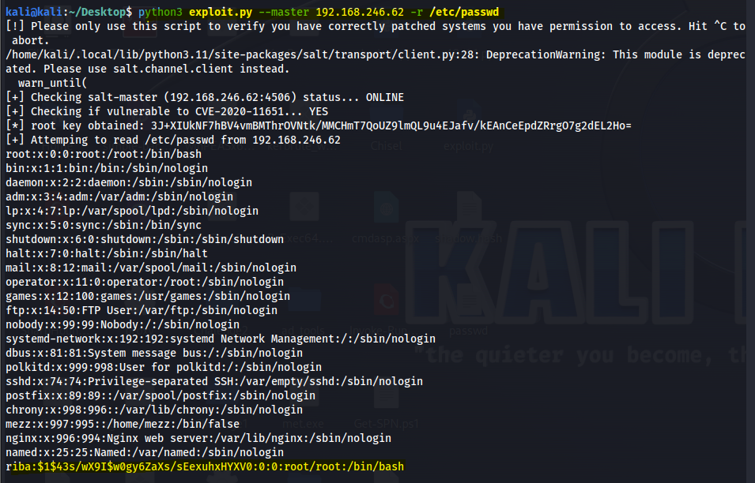
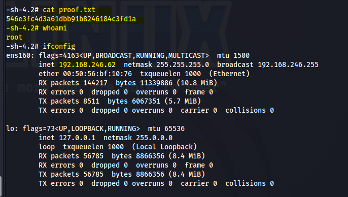

# Twiggy (OffSec Proving Grounds)

`OffSec Proving Grounds` `Arbitrary File Write to Instant Root`

> Using an unauthenticated SaltStack bug to read and then rewrite /etc/passwd, planting a brand new root account and logging straight in with it.

[← Back to index](../README.md)

---

## Machine Overview

Twiggy runs a small nginx fronted web stack alongside something far more interesting, a SaltStack master listening on its default ports. The web application never came into play. Everything about this box turns on a single, well known vulnerability class in Salt's own RPC layer, one that treats file paths as more trustworthy than they should be, and one that shipped without an authentication check where it mattered most.

## Objective

Get an authenticated shell on the target and capture proof.txt.



*Nmap: SaltStack ports 4505 and 4506 open alongside a web stack that never gets touched.*

## Step One: Identifying the Vulnerability

Ports 4505 and 4506 running ZeroMQ ZMTP are the signature of a Salt master. Searching Exploit-DB for the version confirmed a public remote code execution advisory sitting right there.

**Command**

```
searchsploit Saltstack 3000.1
```



*Saltstack 3000.1 Remote Code Execution, EDB 48421.*

The advisory points to a public proof of concept covering CVE-2020-11651, an authentication bypass in the salt master's RPC interface, paired with CVE-2020-11652, a directory traversal that turns that bypass into arbitrary file read and write anywhere on the master's filesystem, well outside the sandbox Salt intends.

## Step Two: Confirming Arbitrary File Read

With the proof of concept downloaded, a read of /etc/passwd was the first test, confirming both that the master was reachable and that the vulnerability was real.

**Command**

```
python3 exploit.py --master 192.168.246.62 -r /etc/passwd
```



*Salt master confirmed vulnerable, /etc/passwd read back in full.*

The script silently obtained an internal authentication token from the master itself, then used it to pull the entire account list back over the wire, no credentials required at any point.

## Step Three: Building a Malicious passwd File

A file that can be read remotely without authentication can usually be written the same way, and /etc/passwd is the one file on a Linux host where write access is equivalent to instant root. The plan was to graft a new account onto it with a UID of zero.

**Command**

```
openssl passwd 123
```



*Password hash generated for the new account.*

The full original passwd contents were saved locally, with one new line appended, a user named riba, the generated hash, UID and GID both zero, and a working shell.



*New line added: riba, root's own UID and GID, /bin/bash as the shell.*

## Step Four: Writing the File Back

The same exploit script that could read arbitrary files could write them too, given a path that escaped the master's intended file root.

**Command**

```
python3 exploit.py --master 192.168.246.62 --upload-src passwd --upload-dest ../../../../../../etc/passwd
```



*Modified passwd file written back to the target's real /etc/passwd.*

A second read confirmed the write landed exactly as intended, the new riba line present at the end of the file.



*Write confirmed: riba now sits in /etc/passwd with UID zero.*

## Step Five: Logging In as Root

There was no separate privilege escalation stage here, since the account created in the previous step already carried root's own UID and GID. SSH with the chosen password was the entire remaining path.

**Command**

```
ssh riba@192.168.246.62
```



*Logged in as riba, whoami already returns root.*

proof.txt: 546e3fc4d3a61d

## Attack Chain Summary

This one was short because the vulnerability did not leave much room for anything else. A missing authentication check on the salt master's RPC interface, paired with a path traversal bug, turned an unauthenticated network connection directly into arbitrary file write. Once that door was open, there was no meaningful distinction left between a low privileged foothold and root, since the attacker got to choose their own account's privilege level the moment /etc/passwd became writable.

## Mitigations and Prevention

> **The fix:** The salt master's RPC methods needed an authentication check before accepting requests, the root cause behind CVE-2020-11651 and CWE-306, Missing Authentication for Critical Function. File paths supplied to the master needed proper validation against directory traversal, the root cause behind CVE-2020-11652 and CWE-22, Path Traversal. Both were patched by SaltStack well before this host was built, so the real fix here is timely patching, plus keeping salt master ports off any network segment reachable by untrusted hosts in the first place.

> **Framework mapping:** Discovering the exposed Salt ports is T1046, Network Service Discovery, in MITRE ATT&CK. Exploiting the unauthenticated RPC interface is T1190, Exploit Public-Facing Application. Planting the new root level account through the arbitrary file write is T1136.001, Create Account, Local Account. And logging in with it is T1078.003, Valid Accounts, Local Accounts.
